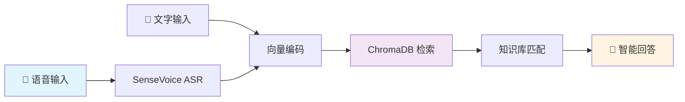

# 🌬️ 智能空调精灵助手 AC Genius Assistant

<div align="center">


**基于 SenseVoice 语音识别 + 向量检索 + 热管理知识库的智能空调问答助手**

[快速开始](#快速开始) • [功能特性](#功能特性) • [架构设计](#架构设计) • [使用示例](#使用示例)

</div>

---

## 💡 项目简介

想象一下：夏日炎炎，空调不制冷了？不知道设置多少度最省电？空调滴水是坏了吗？  
**空调精灵**来帮你！只需说出你的问题，AI 立即给出专业解答 🎯

本项目结合：
- 🎤 **SenseVoice** - 阿里达摩院开源的高精度语音识别引擎
- 🧠 **向量检索** - ChromaDB 实现语义理解，不只是关键词匹配
- 📚 **热管理知识库** - 涵盖故障诊断、节能技巧、健康使用、维护保养等 15+ 专业场景

## ✨ 功能特性

### 🔥 核心能力

| 功能 | 说明 | 示例 |
|------|------|------|
| 🎙️ **语音问答** | 直接说话，秒懂你的问题 | "空调不凉快怎么办" |
| 💬 **文本查询** | 支持文字输入，适配多场景 | CLI 交互 / API 调用 |
| 🔍 **语义检索** | 向量化理解，口语化表达也能准确匹配 | "空调漏水" ≈ "空调滴水" ≈ "内机流水" |
| 📊 **置信度评分** | 每次回答都标注可信度，心里有底 | 🎯 置信度: 92.5% |
| 🏷️ **智能分类** | 故障诊断/节能技巧/健康使用/维护保养... | 自动归类问题类型 |

### 📚 知识库覆盖

```
故障诊断 🔧
├─ 制冷/制热效果差
├─ 异常停机
├─ 漏水滴水
├─ 噪音过大
└─ 遥控器失灵

节能技巧 💰
├─ 温度设置科学依据
├─ 开关机策略
└─ 变频 vs 定频对比

功能使用 ⚙️
├─ 睡眠/除湿/自动模式
└─ 风速/温度配合策略

维护保养 🛠️
├─ 清洗周期
├─ 加氟必要性
└─ 过滤网保养
```

## 🏗️ 架构设计



**技术栈**
- 🎤 ASR: FunASR + SenseVoiceSmall
- 🧠 向量库: ChromaDB (自动 embedding)
- 🔧 框架: FastAPI + Pydantic
- 📦 部署: 支持 CPU/CUDA，适配 Jetson Nano

## 🚀 快速开始

### 环境要求

```bash
Python >= 3.8
CUDA 可选（支持 CPU 模式）
```

### 安装步骤

```bash
# 1. 克隆仓库
git clone https://github.com/Nerolrs/ac-genius-assistant.git
cd ac-genius-assistant

# 2. 安装依赖
pip install -r requirements.txt

# 3. 运行测试（验证知识库）
python test.py

# 4. 启动交互式命令行
python main.py
```

### 启动 API 服务

```bash
# 启动 FastAPI 服务器
python api_server.py

# 访问文档
# http://localhost:8000/docs
```

## 📖 使用示例

### 1️⃣ 命令行交互模式

```bash
$ python main.py

╔═══════════════════════════════════════════════════╗
║                                                   ║
║     🌬️  智能空调精灵助手 AC Genius Assistant     ║
║                                                   ║
╚═══════════════════════════════════════════════════╝

🤔 您的问题: 空调不制冷怎么办

✨ 【故障诊断】
📢 检查以下几点：1) 室外温度是否过高（>40℃）导致压缩机保护 
   2) 过滤网是否堵塞需要清洗 3) 制冷剂是否泄漏 
   4) 室内机蒸发器是否结霜影响换热 5) 设定温度是否合理（建议26-28℃）
🎯 置信度: 95.3%
⏱️  耗时: 0.234s

💭 相关问题:
   1. 空调制热效果不好是什么原因
   2. 空调为什么会突然停机
```

### 2️⃣ API 调用

```python
import requests

response = requests.post("http://localhost:8000/query", json={
    "query": "夏天空调开多少度省电"
})

result = response.json()
print(result["answer"])
# 输出: 科学设定策略：1) 基准温度26-28℃ 2) 根据人员调整...
```

### 3️⃣ 单次查询

```bash
python main.py --query "空调一直开着费电吗"
```

## 📂 项目结构

```
ac-genius-assistant/
├── src/
│   ├── assistant.py           # 核心引擎
│   ├── asr_engine.py          # SenseVoice 语音识别
│   ├── vector_store.py        # 向量存储管理
│   ├── thermal_knowledge.py   # 热管理知识库
│   └── audio_capture.py       # 音频采集（可选）
├── data/
│   └── chroma_db/             # 向量数据库持久化
├── models/                    # 模型缓存目录
├── main.py                    # CLI 入口
├── api_server.py              # FastAPI 服务
├── test.py                    # 测试脚本
└── requirements.txt           # 依赖清单
```

## 🎯 性能指标

| 指标 | 数值 |
|------|------|
| 语音识别准确率 | 95%+ (普通话) |
| 语义匹配准确率 | 90%+ |
| 平均响应时间 | <0.5s (CPU) / <0.2s (GPU) |
| 知识库规模 | 15+ 场景覆盖 |

## 🛠️ 进阶配置

### 在 Jetson 上部署

```python
# 修改 asr_engine.py
self.model = AutoModel(
    model="iic/SenseVoiceSmall",
    device="cuda",  # 启用 GPU 加速
    disable_update=True
)
```

### 扩展知识库

编辑 `src/thermal_knowledge.py`，添加新条目：

```python
{
    "question": "你的新问题",
    "answer": "详细解答",
    "category": "分类标签",
    "keywords": ["关键词1", "关键词2"]
}
```

运行后自动索引到向量库 ✨

## 🤝 贡献指南

欢迎提交 Issue 和 Pull Request！

- 🐛 发现 Bug？ [提交 Issue](https://github.com/Nerolrs/ac-genius-assistant/issues)
- 💡 新功能建议？欢迎讨论！
- 📚 知识库补充？直接 PR！

## 📜 开源协议

本项目采用 MIT 协议开源

## 🙏 致谢

- [FunASR](https://github.com/alibaba-damo-academy/FunASR) - 阿里达摩院语音实验室
- [SenseVoice](https://github.com/FunAudioLLM/SenseVoice) - 高精度多语言语音识别
- [ChromaDB](https://github.com/chroma-core/chroma) - 开源向量数据库

---

<div align="center">

**如果这个项目帮到了你，请给个 ⭐ Star 支持一下！**

Made with ❤️ by [Nerolrs](https://github.com/Nerolrs)

</div>
